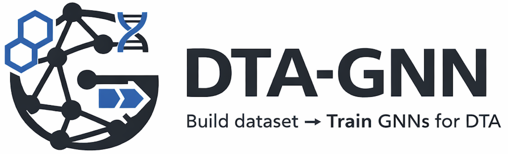

<div align="center">



# DTA-GNN: Target-Specific Binding Affinity Dataset Builder and GNN Trainer

**Build leakage-free Drug-Target Affinity datasets from ChEMBL and train Graph Neural Networks for your targets of interest.**

[](https://www.python.org/downloads/)
[](https://pytorch.org/)
[](https://opensource.org/licenses/MIT)
[]()

**🧬 From ChEMBL target → Clean dataset → Trained GNN for your target of interest**

[Documentation](docs/) · [Examples](#-examples) · [API Reference](docs/interfaces/python-api.md)

</div>

---

## 🎯 Overview

DTA-GNN is an **end-to-end toolkit** for Drug-Target Affinity prediction that:

1. **Curates** clean, leakage-free datasets from ChEMBL
2. **Converts** molecules to 2D molecular graphs or Morgan fingerprints
3. **Trains** baseline models (Random Forest, SVR) and Graph Neural Networks (GIN, GCN, GAT, GraphSAGE, PNA, Transformer, TAG, ARMA, Cheb, SuperGAT)
4. **Evaluates** with proper scaffold-aware splitting

<div align="center">


*Figure 1. DTA-GNN workflow: clean data from ChEMBL, molecular graph conversion, scaffold-aware splitting, and GNN training.*
</div>

---

## 📦 Installation

### pip

```bash
# from source (development)
pip install -e .

# With development tools (for contributors)
pip install -e ".[dev]"
```

```bash
# from PyPI (coming soon!)
pip install dta-gnn 

```

### Docker

```bash
# Pull from GitHub Container Registry
docker pull ghcr.io/gozsari/dta-gnn:latest

# Run Web UI (Web API mode - no local database needed)
docker run --rm -p 7860:7860 ghcr.io/gozsari/dta-gnn:latest \
    dta_gnn ui --host 0.0.0.0

# Run Web UI with local ChEMBL database
docker run --rm -p 7860:7860 \
  -v $(pwd)/chembl_dbs:/home/dtagnn/app/chembl_dbs \
  -v $(pwd)/runs:/home/dtagnn/app/runs \
  ghcr.io/gozsari/dta-gnn:latest dta_gnn ui --host 0.0.0.0
# In the UI, use path: chembl_dbs/chembl_36.db

# Run CLI commands
docker run --rm -v $(pwd)/runs:/home/dtagnn/app/runs \
  ghcr.io/gozsari/dta-gnn:latest \
  dta_gnn setup --version 36 --dir ./chembl_dbs

# Or use Docker Compose
docker-compose up ui        # Web UI
docker-compose up jupyter   # Jupyter Lab
```

---

## 🚀 Quick Start

Dataset building and GNN training are done via the **Python API** or **Web UI**. The CLI provides setup and UI launch only.

### CLI

```bash
# Download ChEMBL database (optional, for faster data access)
dta_gnn setup --version 36 --dir ./chembl_dbs

# Launch the Web UI
dta_gnn ui
```

### Python API

```python
from dta_gnn.pipeline import Pipeline
from dta_gnn.models import train_random_forest_on_run, train_svr_on_run, train_gnn_on_run, GnnTrainConfig

# 1. Build dataset for your target of interest
pipeline = Pipeline(source_type="web")
dataset = pipeline.build_dta(
    target_ids=["CHEMBL1862"],  # Your kinase, GPCR, or other target
    split_method="scaffold",    # Proper leakage-free splitting
)

# 2. Train a baseline model (Random Forest or SVR)
rf_result = train_random_forest_on_run("runs/current", n_estimators=500)
print(f"RF Test RMSE: {rf_result.metrics['splits']['test']['rmse']:.3f}")

# Or train SVR
svr_result = train_svr_on_run("runs/current", C=10.0, epsilon=0.1, kernel="rbf")
print(f"SVR Test RMSE: {svr_result.metrics['splits']['test']['rmse']:.3f}")

# 3. Train a Graph Neural Network
config = GnnTrainConfig(
    architecture="gin",    # GIN, GCN, GAT, GraphSAGE, PNA, Transformer, TAG, ARMA, Cheb, SuperGAT
    hidden_dim=256,
    num_layers=5,
    epochs=100,
)
gnn_result = train_gnn_on_run("runs/current", config=config)
print(f"GNN Test RMSE: {gnn_result.metrics['splits']['test']['rmse']:.3f}")
```

---

## 🖥️ Web UI

DTA-GNN includes an interactive Gradio-based web interface for building datasets without writing code.


### Launch the UI

```bash
# Using pip
dta_gnn ui

# Using Docker
docker run --rm -p 7860:7860 ghcr.io/gozsari/dta-gnn:latest \
    dta_gnn ui --host 0.0.0.0

# Using Docker Compose
docker-compose up ui
```

The UI will be available at `http://localhost:7860` (or the specified host/port).

---

## 🔑 Key Features

### 🤖 Model Training
- **Baseline models**: Random Forest and SVR using Morgan fingerprints (ECFP4)
- **10 GNN architectures**: GIN, GCN, GAT, GraphSAGE, PNA, Transformer, TAG, ARMA, Cheb, SuperGAT
- **Configurable**: Layers, pooling, residual connections, hyperparameters
- **Embeddings**: Extract learned molecular representations from GNNs

### 🔒 Leakage Prevention
- Scaffold-aware train/test splits
- Temporal splits for prospective prediction
- Automatic leakage auditing

### 📦 End-to-End Pipeline
- ChEMBL data fetching (Web API or SQLite)
- Standardized pChEMBL conversion
- Duplicate aggregation
- Dataset cards for reproducibility

### 🖥️ Multiple Interfaces
- **CLI**: Quick experiments from terminal
- **Python API**: Integration in pipelines
- **Web UI**: [Interactive dataset building](#️-web-ui) - No coding required

---

## Supported GNN Architectures

DTA-GNN supports multiple Graph Neural Network (GNN) architectures out of the box, enabling flexibility across different graph structures, scales, and learning objectives.

| Architecture | Description | Key Characteristics |
|--------------|-------------|---------------------|
| **GIN** | Graph Isomorphism Network | Highly expressive; sum aggregation with learnable ε; MLP-based updates with strong theoretical discriminative power |
| **GCN** | Graph Convolutional Network | Symmetric normalized adjacency; efficient and stable spectral convolution; strong baseline for semi-supervised learning |
| **GAT** | Graph Attention Network | Learnable neighbor attention; multi-head attention for stability; supports edge features and residual connections |
| **GraphSAGE** | Sample and Aggregate | Inductive learning; neighborhood sampling for scalability; flexible aggregators (mean, max, LSTM) |
| **PNA** | Principal Neighbourhood Aggregation | Multiple aggregators and degree-aware scalers; adapts to varying node degree distributions; robust on heterogeneous graphs |
| **Transformer** | Graph Transformer with multi-head attention | Dot-product self-attention; optional edge features; gated skip connections for stable deep learning |
| **TAG** | Topology Adaptive Graph Convolution | Explicit K-hop message passing; adapts filters to local topology; polynomial-style convolution |
| **ARMA** | Auto-Regressive Moving Average | Recursive stacked filters with residual connections; stable deep propagation; efficient spectral approximation |
| **Cheb** | Chebyshev Spectral Graph Convolution | K-hop localized spectral filtering; Chebyshev polynomial approximation; avoids eigen-decomposition |
| **SuperGAT** | Supervised Graph Attention Network | Self-supervised attention via link prediction; combines structural and feature-based attention; robust attention learning |

### Configuration

```python
from dta_gnn.models import GnnTrainConfig

config = GnnTrainConfig(
    architecture="gin",        # gin, gcn, gat, sage, pna, transformer, tag, arma, cheb, supergat
    embedding_dim=128,         # Atom embedding dimension
    hidden_dim=256,            # Hidden layer dimension
    num_layers=5,              # Number of message passing layers
    dropout=0.1,               # Dropout rate
    pooling="attention",       # add, mean, max, attention
    residual=True,             # Residual connections
    # Architecture-specific parameters (optional)
    gin_conv_mlp_layers=2,     # GIN: MLP depth in convolution
    gin_train_eps=False,       # GIN: Whether to learn epsilon
    gin_eps=0.0,               # GIN: Initial epsilon value
    gat_heads=4,               # GAT: Number of attention heads
    sage_aggr="mean",          # GraphSAGE: Aggregation (mean, max, lstm, pool)
    transformer_heads=4,       # Transformer: Number of attention heads
    tag_k=2,                   # TAG: K-hop message passing
    arma_num_stacks=1,         # ARMA: Number of stacks
    arma_num_layers=1,         # ARMA: Number of layers per stack
    cheb_k=2,                  # Cheb: K-hop spectral filtering
    supergat_heads=4,          # SuperGAT: Number of attention heads
    supergat_attention_type="MX",  # SuperGAT: Attention type (MX, SD)
    lr=1e-3,                   # Learning rate
    batch_size=64,
    epochs=100,
)
```

---

## 🔬 Molecular Graph Representation

DTA-GNN converts SMILES to rich 2D molecular graphs:

```
Molecule (SMILES) → Atoms (Nodes) + Bonds (Edges) → GNN → Prediction
```

**Node Features (6D):**
- Atomic number
- Total degree
- Formal charge
- Total H count
- Aromaticity
- Atomic mass

**Edge Features (6D):**
- Single/Double/Triple bond
- Aromaticity
- Conjugation
- Ring membership

```python
from dta_gnn.features.molecule_graphs import smiles_to_graph_2d

# Convert any molecule to a graph
graph = smiles_to_graph_2d(
    molecule_chembl_id="aspirin",
    smiles="CC(=O)OC1=CC=CC=C1C(=O)O"
)
print(f"Atoms: {len(graph.atom_type)}, Bonds: {graph.edge_index.shape[1]//2}")
```

---

## 📊 Examples

### Complete Workflow

```python
from dta_gnn.pipeline import Pipeline
from dta_gnn.models import train_gnn_on_run, GnnTrainConfig
from dta_gnn.audits import audit_scaffold_leakage

# Step 1: Build dataset for kinase targets
pipeline = Pipeline(source_type="sqlite", sqlite_path="chembl_36.db")
df = pipeline.build_dta(
    target_ids=["CHEMBL1862", "CHEMBL2111", "CHEMBL3778"],
    split_method="scaffold",
)
print(f"Dataset: {len(df)} drug-target pairs")

# Step 2: Verify no data leakage
train = df[df["split"] == "train"]
test = df[df["split"] == "test"]
audit = audit_scaffold_leakage(train, test)
print(f"Scaffold leakage: {audit['leakage_ratio']:.1%}")  # Should be 0%

# Step 3: Train GNN model
config = GnnTrainConfig(
    architecture="gin",
    hidden_dim=256,
    num_layers=5,
    pooling="attention",
    epochs=100,
)
result = train_gnn_on_run("runs/current", config=config)

# Step 4: Evaluate
print(f"Train RMSE: {result.metrics['splits']['train']['rmse']:.3f}")
print(f"Val RMSE:   {result.metrics['splits']['val']['rmse']:.3f}")
print(f"Test RMSE:  {result.metrics['splits']['test']['rmse']:.3f}")

# Step 5: Extract molecular embeddings for downstream tasks
from dta_gnn.models import extract_gnn_embeddings_on_run
embeddings = extract_gnn_embeddings_on_run("runs/current")
print(f"Extracted {embeddings.n_molecules} embeddings of dim {embeddings.embedding_dim}")
```

---

## 👥 Who Is This For?

| You Are... | You Want To... | DTA-GNN Gives You... |
|------------|----------------|---------------------|
| **Drug Discovery Researcher** | Predict affinity for your target | End-to-end pipeline with baseline models and GNNs |
| **ML Researcher** | Benchmark new GNN architectures | Leakage-free datasets + baselines (RF, SVR, 10 GNN architectures) |
| **Computational Chemist** | Screen compounds virtually | Trained models + embeddings |

---

## 📖 Documentation

- [Installation Guide](docs/getting-started/installation.md)
- [Quick Start](docs/getting-started/quickstart.md)
- [GNN Training Guide](docs/modeling/models.md)
- [API Reference](docs/interfaces/python-api.md)

---

## 🧪 Testing

```bash
pytest tests/ -v
```

---

## 📄 License

MIT License - see [LICENSE](LICENSE)

---

## 📚 Citation

```bibtex
@software{dta_gnn,
  title = {DTA-GNN: Target-Specific Binding Affinity Dataset Builder and GNN Trainer},
  author = {Özsari, Gökhan},
  year = {2026},
  url = {https://github.com/gozsari/DTA-GNN}
}
```
