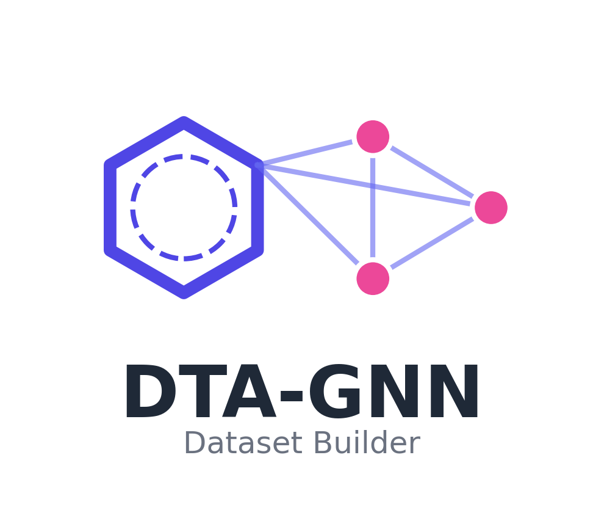
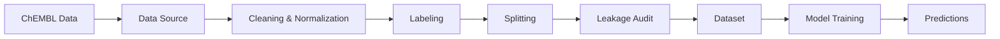

# DTA-GNN

<div align="center">
  
  <p><strong>Target-Specific Binding Affinity Dataset Builder and GNN Trainer</strong></p>
</div>

---

## Overview

**DTA-GNN** is a comprehensive toolkit for building high-quality target-specific binding affinity datasets from the ChEMBL database and training Graph Neural Networks for your targets of interest. It provides end-to-end support for dataset construction, from data ingestion to model training, with a strong focus on reproducibility and preventing data leakage.

## Key Features

<div class="grid cards" markdown>

-   :material-database-import:{ .lg .middle } **Flexible Data Ingestion**

    ---

    Support for both ChEMBL web API and local SQLite database dumps for maximum flexibility.

    [:octicons-arrow-right-24: Data Sources](user-guide/data-sources.md)

-   :material-broom:{ .lg .middle } **Rigorous Data Cleaning**

    ---

    Automated unit standardization, deduplication, pChEMBL conversion, and censored value handling.

    [:octicons-arrow-right-24: Cleaning](user-guide/cleaning.md)

-   :material-graph-outline:{ .lg .middle } **Smart Dataset Splitting**

    ---

    Scaffold, Random, and Temporal splits to prevent data leakage.

    [:octicons-arrow-right-24: Splits](user-guide/splits.md)

-   :material-shield-check:{ .lg .middle } **Leakage Audits**

    ---

    Built-in checks for train/test contamination to ensure valid model evaluation.

    [:octicons-arrow-right-24: Audits](user-guide/audits.md)

-   :material-desktop-classic:{ .lg .middle } **Multiple Interfaces**

    ---

    CLI, Python API, and an interactive Gradio web UI for dataset construction.

    [:octicons-arrow-right-24: Interfaces](interfaces/cli.md)

-   :material-robot:{ .lg .middle } **Model Training**

    ---

    Train baseline models (RandomForest, SVR) and 10 GNN architectures (GIN, GCN, GAT, GraphSAGE, PNA, Transformer, TAG, ARMA, Cheb, SuperGAT) directly on your curated datasets.

    [:octicons-arrow-right-24: Models](modeling/models.md)

</div>

## Quick Example

=== "Python API"

    ```python
    from dta_gnn.pipeline import Pipeline

    # Initialize pipeline with SQLite database
    pipeline = Pipeline(source_type="sqlite", sqlite_path="chembl_36.db")

    # Build a DTA regression dataset
    df = pipeline.build_dta(
        target_ids=["CHEMBL204", "CHEMBL205"],  # Specific targets
        split_method="scaffold",                 # Scaffold-based split
        test_size=0.2,
        val_size=0.1
    )

    print(f"Dataset shape: {df.shape}")
    print(df.head())
    ```

=== "CLI"

    ```bash
    # Dataset building is via Python API or Web UI. CLI provides setup and UI:
    dta_gnn setup --version 36 --dir ./chembl_dbs   # Optional: download ChEMBL DB
    dta_gnn ui                                       # Launch the Web UI
    ```

=== "Web UI"

    ```bash
    # Launch the interactive web interface
    dta_gnn ui
    ```

## Installation

```bash
pip install dta-gnn
```

GNN support and Weights & Biases (W&B) are included in the default install. For development (testing, linting), use `pip install -e ".[dev]"`.

[:octicons-arrow-right-24: Complete Installation Guide](getting-started/installation.md)

## Supported Task Types

| Task Type | Description | Label |
|-----------|-------------|-------|
| **DTA (Regression)** | Target-Specific Binding Affinity prediction | Continuous pChEMBL value |

## Supported Models

| Model | Features | Task Type | Speed |
|-------|----------|-----------|-------|
| **Random Forest** | Morgan FP (ECFP4) | Regression | Fast |
| **SVR** | Morgan FP (ECFP4) | Regression | Medium |
| **GNN** | 2D Molecular Graphs | Regression | Slow |

**GNN Architectures (10 total):**
- GIN, GCN, GAT, GraphSAGE, PNA, Transformer, TAG, ARMA, Cheb, SuperGAT

## Architecture



## Citation

If you use DTA-GNN in your research, please cite:

```bibtex
@software{dta_gnn,
  title = {DTA-GNN: Target-Specific Binding Affinity Dataset Builder and GNN Trainer},
  year = {2026},
  url = {https://github.com/gozsari/DTA-GNN}
}
```

## License

DTA-GNN is released under the MIT License. See the [LICENSE](https://github.com/gozsari/DTA-GNN/blob/main/LICENSE) file for details.
