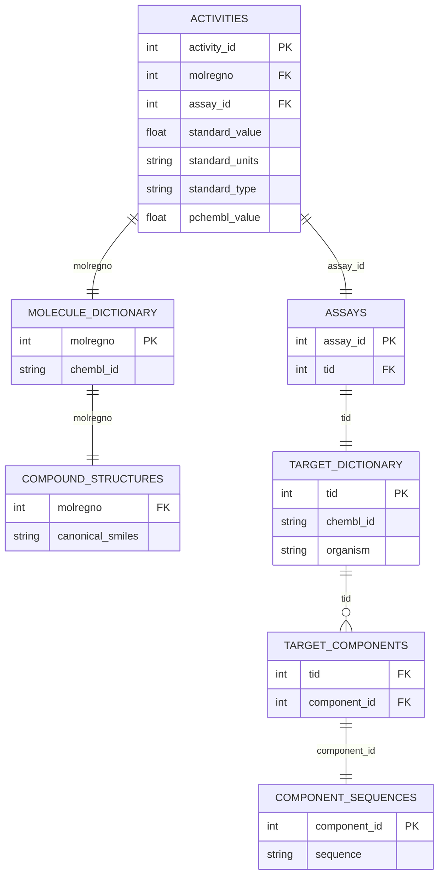

# Data Sources

DTA-GNN supports two data sources for fetching bioactivity data: the ChEMBL Web API and local SQLite databases.

## Overview

| Feature | Web API | SQLite |
|---------|---------|--------|
| **Setup** | None required | Download ~5GB database |
| **Speed** | Slower (network) | Fast (local) |
| **Offline** | No | Yes |
| **Rate Limits** | Yes | No |
| **Recommended for** | Small queries, testing | Production, large datasets |

## SQLite Source (Recommended)

The SQLite source uses a local copy of the ChEMBL database, providing fast access without network dependencies.

### Setup

Download the ChEMBL SQLite database:

=== "Automatic"

    ```bash
    dta_gnn setup --version 36 --dir ./chembl_dbs
    ```

=== "Manual"

    ```bash
    # Download from EBI FTP
    wget https://ftp.ebi.ac.uk/pub/databases/chembl/ChEMBLdb/releases/chembl_36/chembl_36_sqlite.tar.gz
    
    # Extract
    tar -xzf chembl_36_sqlite.tar.gz
    ```

### Usage

=== "Python"

    ```python
    from dta_gnn.pipeline import Pipeline
    
    pipeline = Pipeline(
        source_type="sqlite",
        sqlite_path="./chembl_dbs/chembl_36.db"
    )
    
    df = pipeline.build_dta(
        target_ids=["CHEMBL204"],
        split_method="scaffold"
    )
    ```

=== "CLI"

    ```bash
    dta_gnn setup --version 36 --dir ./chembl_dbs
    ```

=== "UI"

    1. Select "SQLite" as the data source
    2. Enter the path to your `.db` file
    3. Proceed with dataset building

### Python API Download

Download ChEMBL databases programmatically:

```python
from dta_gnn.io.downloader import download_chembl_db

# Download ChEMBL 36
db_path = download_chembl_db(version="36", output_dir="./chembl_dbs")
print(f"Database at: {db_path}")
```

### Direct SQLite Access

For advanced queries, you can use the `ChemblSQLiteSource` class directly:

```python
from dta_gnn.io.sqlite_source import ChemblSQLiteSource

source = ChemblSQLiteSource("./chembl_dbs/chembl_36.db")

# Fetch activities for specific targets
activities = source.fetch_activities(
    target_ids=["CHEMBL204", "CHEMBL205"],
    standard_types=["IC50", "Ki", "Kd"]
)

# Fetch molecules
molecules = source.fetch_molecules(
    molecule_ids=["CHEMBL25", "CHEMBL192"]
)

# Fetch target information (including sequences)
targets = source.fetch_targets(
    target_ids=["CHEMBL204"]
)
```

### Database Schema

The SQLite source queries these main tables:



## Web API Source

The Web API source fetches data from the ChEMBL REST API. It's convenient for small queries but slower for large datasets.

### Usage

=== "Python"

    ```python
    from dta_gnn.pipeline import Pipeline
    
    pipeline = Pipeline(source_type="web")
    
    df = pipeline.build_dta(
        target_ids=["CHEMBL204"],
        split_method="scaffold"
    )
    ```

=== "CLI"

    ```bash
    # Dataset building is available via the Web UI or Python API:
    dta_gnn ui
    ```

### Rate Limiting

The ChEMBL Web API has rate limits. For large queries:

- Use pagination (handled automatically)
- Add delays between requests
- Consider switching to SQLite for production use

### Direct Web API Access

```python
from dta_gnn.io.web_source import ChemblWebSource

source = ChemblWebSource()

# Fetch activities
activities = source.fetch_activities(
    target_ids=["CHEMBL204"],
    standard_types=["IC50"]
)

# Fetch molecules
molecules = source.fetch_molecules(
    molecule_ids=["CHEMBL25"]
)
```

## Activity Types

Both sources support filtering by activity type:

| Type | Description |
|------|-------------|
| `IC50` | Half-maximal inhibitory concentration |
| `Ki` | Inhibition constant |
| `Kd` | Dissociation constant |
| `EC50` | Half-maximal effective concentration |
| `potency` | General potency measure |

### Specifying Activity Types

```python
# Python API
df = pipeline.build_dta(
    target_ids=["CHEMBL204"],
    standard_types=["IC50", "Ki", "Kd"]  # Specify types
)
```

## Performance Tips

### SQLite Optimization

1. **Use SSD storage**: Queries are I/O-bound
2. **Increase page cache**: For repeated queries

```python
import sqlite3

# Custom connection with larger cache
conn = sqlite3.connect("chembl_36.db")
conn.execute("PRAGMA cache_size = 10000")
conn.execute("PRAGMA temp_store = MEMORY")
```

### Memory Management

For very large queries:

```python
# Process in chunks
from dta_gnn.io.sqlite_source import ChemblSQLiteSource

source = ChemblSQLiteSource("chembl_36.db")

# Fetch all target IDs first
import sqlite3
conn = sqlite3.connect("chembl_36.db")
targets = pd.read_sql("SELECT chembl_id FROM target_dictionary", conn)

# Process in batches
for batch in np.array_split(targets["chembl_id"], 10):
    activities = source.fetch_activities(target_ids=batch.tolist())
    # Process batch...
```

## Troubleshooting

### "Database does not contain 'activities' table"

Ensure you're using a valid ChEMBL SQLite database:

```bash
# Verify tables
sqlite3 chembl_36.db ".tables" | grep activities
```

### "File not found"

Check the database path:

```python
import os
print(os.path.exists("./chembl_dbs/chembl_36.db"))  # Should be True
```

### Slow Web API queries

Switch to SQLite for better performance, or reduce the query scope:

```python
# Instead of all targets:
pipeline.build_dta(target_ids=None)  # Very slow

# Use specific targets:
pipeline.build_dta(target_ids=["CHEMBL204", "CHEMBL205"])  # Faster
```
