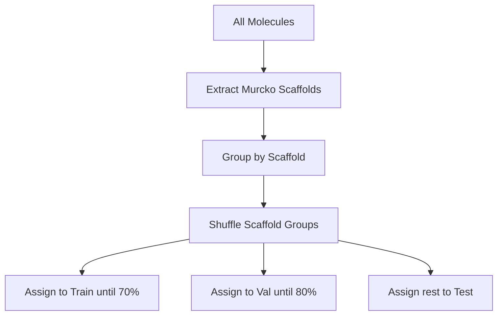

# Dataset Splitting

Proper dataset splitting is critical for valid model evaluation in drug discovery. DTA-GNN provides several splitting strategies to prevent data leakage and ensure realistic performance estimates.

## Why Splitting Matters

!!! warning "Data Leakage"
    Random splitting in drug discovery often leads to **scaffold leakage**: molecules with the same chemical scaffold appear in both train and test sets, causing inflated performance metrics.

The choice of splitting strategy should match your deployment scenario:

| Scenario | Recommended Split |
|----------|-------------------|
| Predict activity for new scaffolds | Scaffold split |
| Prospective prediction of future compounds | Temporal split |
| General baseline | Random split |

## Available Strategies

### Random Split

Random assignment of samples to train/val/test sets.

```python
from dta_gnn.splits import split_random

df_split, train, val, test = split_random(
    df,
    test_size=0.2,
    val_size=0.1,
    seed=42
)
```

**Characteristics:**

- ✅ Simple and fast
- ✅ Good for general ML benchmarks
- ❌ Causes scaffold leakage
- ❌ Overly optimistic performance estimates

**Use when:**

- Establishing a baseline
- Dataset doesn't have scaffold structure
- Computational resources are limited

### Scaffold Split (Cold-Drug)

Splits based on Murcko scaffolds, ensuring molecules with the same core structure stay in the same partition.

```python
from dta_gnn.splits import split_cold_drug_scaffold

df_split = split_cold_drug_scaffold(
    df,
    smiles_col="smiles",
    test_size=0.2,
    val_size=0.1,
    seed=42
)
```

**Characteristics:**

- ✅ Prevents scaffold leakage
- ✅ Simulates real drug discovery scenario
- ✅ More realistic performance estimates
- ❌ Uneven split sizes possible

**Use when:**

- Evaluating generalization to new chemical series
- Drug discovery applications
- Publication-quality results

#### How Scaffold Split Works



1. Extract Murcko scaffold for each molecule
2. Group molecules by scaffold
3. Shuffle scaffold groups
4. Assign entire groups to splits (keeping scaffolds together)

### Temporal Split

Splits based on publication year to simulate prospective prediction.

```python
from dta_gnn.splits import split_temporal

df_split = split_temporal(
    df,
    year_col="year",
    split_year=2022,
    val_size=0.1
)
```

**Characteristics:**

- ✅ Simulates real-world deployment
- ✅ Tests temporal generalization
- ✅ Most realistic evaluation
- ❌ Requires year information
- ❌ Unbalanced splits if data is concentrated

**Use when:**

- Simulating prospective prediction
- Evaluating model stability over time
- Regulatory/validation purposes

## Configuration via Pipeline

The `Pipeline` class handles splitting automatically:

```python
from dta_gnn.pipeline import Pipeline

pipeline = Pipeline(source_type="sqlite", sqlite_path="chembl_36.db")

df = pipeline.build_dta(
    target_ids=["CHEMBL204", "CHEMBL205"],
    split_method="scaffold",  # Options: random, scaffold, temporal
    test_size=0.2,
    val_size=0.1,
    split_year=2022  # Only for temporal split
)
```

## Split Distribution

After splitting, verify the distribution:

```python
print(df["split"].value_counts())
# train    7000
# val      1000
# test     2000

# For scaffold split, also check scaffold overlap
from dta_gnn.audits import audit_scaffold_leakage

train = df[df["split"] == "train"]
test = df[df["split"] == "test"]
audit = audit_scaffold_leakage(train, test)
print(f"Scaffold leakage ratio: {audit['leakage_ratio']:.2%}")
```

## Comparison of Strategies

| Strategy | Leakage Prevention | Realism | Implementation |
|----------|-------------------|---------|----------------|
| Random | None | Low | Simple |
| Scaffold | Scaffold-level | Medium-High | RDKit required |
| Temporal | Time-based | Very High | Year data required |

## Best Practices

!!! tip "Splitting Guidelines"
    
    1. **Never use random splits for drug discovery** - Use scaffold split
    2. **Report split strategy clearly** - Essential for reproducibility
    3. **Check for leakage after splitting** - Use the audit functions
    4. **Use same seed for reproducibility** - Default is 42
    5. **Consider multiple splits** - For more robust evaluation

## CLI Usage

```python
from dta_gnn.pipeline import Pipeline

pipeline = Pipeline(source_type="sqlite", sqlite_path="./chembl_dbs/chembl_36.db")

# Scaffold split
df = pipeline.build_dta(target_ids=["CHEMBL204"], split_method="scaffold", output_path="dataset.csv")

# Temporal split
df = pipeline.build_dta(target_ids=["CHEMBL204"], split_method="temporal", split_year=2022, output_path="dataset.csv")
```

## Troubleshooting

### Uneven split sizes

Scaffold split may produce uneven splits due to large scaffold groups:

```python
# Check scaffold distribution
from rdkit.Chem.Scaffolds import MurckoScaffold

scaffolds = df["smiles"].apply(
    lambda s: MurckoScaffold.MurckoScaffoldSmiles(s) if pd.notna(s) else None
)
print(scaffolds.value_counts().head(10))
```

### Missing year column for temporal split

Ensure your data includes publication year:

```python
# Check year availability
print(df["year"].notna().sum() / len(df))
# Should be close to 1.0
```

### Very small test set

If test set is too small after splitting:

1. Use more targets
2. Adjust split ratios
3. Consider a different splitting strategy
